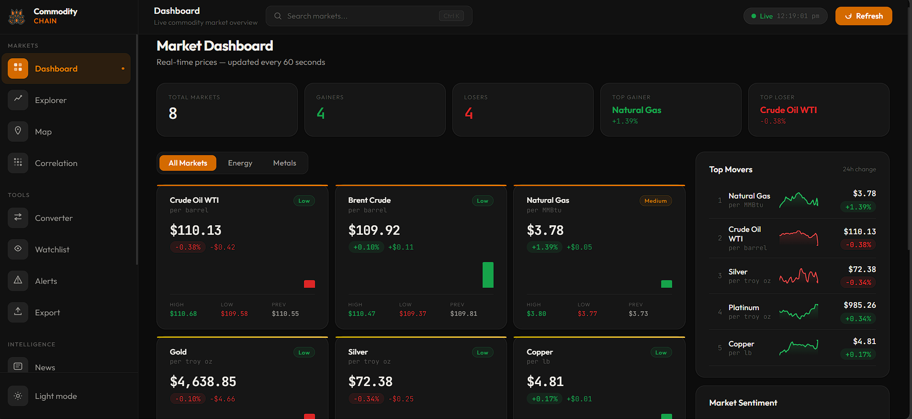

# CommodityChain 🛢️📈

> Real-time commodity intelligence platform — live prices, AI analysis, India macro layer, news feed, alerts, and interactive tools.



**Frontend:** [commoditychain.vercel.app](https://commoditychain.vercel.app) &nbsp;·&nbsp; **Backend API:** [API Docs](https://commoditychain-api-ayaveegddsfagxc8.centralindia-01.azurewebsites.net/docs)

---

## Overview

CommodityChain is a full-stack commodity market intelligence platform that aggregates real-time price data for energy and metals commodities (crude oil, gold, silver, copper, and more), enriches it with AI-powered analysis, and presents it through an interactive Next.js dashboard. It features a WebSocket-driven live price stream, an India-specific macro layer (city-wise fuel prices, tax breakdown, inflation indicators), a Groq-powered AI analyst with three persona modes, a correlation heatmap, a shock simulator, and data export — all designed with a clean dark/light design system.

---

## Features

| Module | Description |
|---|---|
| **Dashboard** | Live price cards, bar charts, top movers, market sentiment |
| **Explorer** | Full price history chart (1W/1M/3M/1Y), OHLC table, watchlist toggle |
| **Map** | D3 world map — producer/consumer profiles for 20 countries |
| **Correlation** | 8×8 Pearson correlation heatmap (30-day rolling window) |
| **Converter** | Currency + commodity unit + value converter with live FX rates |
| **Watchlist** | Hypothetical portfolio with live unrealised PnL |
| **Alerts** | Browser push notification price alerts (persisted via localStorage) |
| **Export Data** | CSV / JSON price history download |
| **News** | Commodity-filtered news feed with AI sentiment labels |
| **Learn** | Explainer articles — oil, gold, futures, copper, India context |
| **Analyst** | Groq Llama 3.3 70B chat with live price context + 3 persona modes |
| **Simulator** | India macro impact model — drag crude price, see petrol/inflation/INR |
| **India Layer** | City-wise petrol/diesel prices + tax breakdown + macro indicators |

---

## Tech Stack

| Layer | Technology |
|---|---|
| **Frontend** | Next.js 14 + TypeScript |
| **Styling** | Custom CSS variable design system (dark + light mode) |
| **Backend** | FastAPI + WebSockets |
| **AI** | Groq Llama 3.3 70B (free tier) |
| **Price Data** | yfinance (real-time futures) with GBM simulation fallback |
| **FX Rates** | open.er-api.com |
| **News** | NewsAPI + curated fallback |
| **Frontend Host** | Vercel |
| **Backend Host** | Azure App Service (B1 · Central India) |
| **CI/CD** | GitHub Actions |

---

## Project Structure

```
commoditychain/
├── backend/
│   ├── main.py                      # FastAPI app entry point, 9 routers
│   ├── requirements.txt
│   ├── Procfile                     # Azure App Service startup
│   ├── .python-version              # Python 3.11
│   ├── services/
│   │   └── commodity_service.py     # yfinance fetcher + GBM fallback + cache
│   ├── models/
│   │   └── commodity.py             # Pydantic data models
│   └── routers/
│       ├── prices.py                # GET /api/prices, /api/prices/:id
│       ├── websocket.py             # WS /ws/prices — live broadcast loop
│       ├── news.py                  # GET /api/news — NewsAPI + sentiment
│       ├── fx.py                    # GET /api/rates — live FX rates
│       ├── analyst.py               # POST /api/analyst — Groq LLM
│       ├── simulator.py             # POST /api/simulate — India macro model
│       ├── export.py                # GET /api/export/:id — CSV/JSON
│       ├── india.py                 # GET /api/india/prices
│       └── correlation.py           # GET /api/correlation — Pearson matrix
├── frontend/
│   └── src/
│       ├── app/                     # 13 Next.js App Router pages
│       │   ├── page.tsx             # Dashboard
│       │   ├── explorer/
│       │   ├── map/
│       │   ├── correlation/
│       │   ├── converter/
│       │   ├── watchlist/
│       │   ├── alerts/
│       │   ├── export/
│       │   ├── news/
│       │   ├── learn/
│       │   ├── analyst/
│       │   ├── simulator/
│       │   └── india/
│       ├── components/
│       │   ├── Navbar.tsx
│       │   ├── Sidebar.tsx
│       │   ├── PriceCard.tsx
│       │   ├── Ticker.tsx
│       │   ├── StatsBar.tsx
│       │   ├── Topbar.tsx
│       │   ├── CommodityBackground.tsx
│       │   └── charts/
│       ├── hooks/
│       │   ├── usePrices.ts
│       │   ├── useTheme.ts
│       │   └── useWatchlist.ts
│       └── lib/
│           ├── api.ts
│           ├── constants.ts
│           └── utils.ts
├── docs/
│   └── dashboard.png
└── .github/
    └── workflows/
        └── main_commoditychain-api.yml   # Azure backend CI/CD
```

---

## Local Setup

### Prerequisites

- **Python 3.11** — [python.org](https://www.python.org/downloads/)
- **Node.js 18+** — [nodejs.org](https://nodejs.org/)
- **API Keys** (free tiers are sufficient):
  - [console.groq.com](https://console.groq.com) → API Keys → Create *(AI Analyst)*
  - [newsapi.org](https://newsapi.org) → Get API Key *(News feed, optional)*
  - No key needed for yfinance (price data) or FX rates

---

### 1. Clone the repository

```bash
git clone https://github.com/your-username/commoditychain.git
cd commoditychain
```

---

### 2. Backend setup

```bash
cd backend

# Create and activate a virtual environment (Python 3.11)
# Windows (PowerShell)
py -3.11 -m venv venv
.\venv\Scripts\Activate.ps1

# macOS / Linux
python3.11 -m venv venv
source venv/bin/activate

# Install dependencies
pip install -r requirements.txt

# Create environment file
cp .env.example .env   # or create manually (see below)
```

**`backend/.env`**
```env
ALLOWED_ORIGINS=http://localhost:3000
GROQ_API_KEY=your_groq_key_here        # console.groq.com — free
NEWS_API_KEY=your_newsapi_key_here     # newsapi.org — optional
WEBSITES_PORT=8000
```

```bash
# Start the backend server
uvicorn main:app --reload --port 8000
```

API is running at `http://localhost:8000` · Interactive docs at `http://localhost:8000/docs`

---

### 3. Frontend setup

Open a second terminal:

```bash
cd frontend

# Install dependencies
npm install

# Create environment file
cp .env.local.example .env.local   # or create manually (see below)
```

**`frontend/.env.local`**
```env
NEXT_PUBLIC_API_URL=http://localhost:8000
NEXT_PUBLIC_WS_URL=ws://localhost:8000
```

```bash
# Start the development server
npm run dev
```

Frontend is running at `http://localhost:3000`

---

## API Reference

| Method | Route | Description |
|---|---|---|
| `GET` | `/api/prices` | All commodity prices (cached, 60s TTL) |
| `GET` | `/api/prices/:id` | Single commodity by ID |
| `GET` | `/api/news` | News feed with AI sentiment labels |
| `GET` | `/api/rates` | Live FX rates |
| `POST` | `/api/analyst` | AI analysis via Groq Llama 3.3 70B |
| `POST` | `/api/simulate` | India macro shock model |
| `GET` | `/api/export/:id` | CSV/JSON price history download |
| `GET` | `/api/india/prices` | City-wise petrol/diesel prices |
| `GET` | `/api/correlation` | 30-day Pearson correlation matrix |
| `WS` | `/ws/prices` | Live price WebSocket stream |

### AI Analyst Personas

The `/api/analyst` endpoint accepts a `persona` field:

| Persona | Style |
|---|---|
| `normal` | Friendly, jargon-free, practical takeaway |
| `trader` | Technical, data-focused, includes risk note |
| `student` | Educational, connects to macro fundamentals |

---

## Supported Commodities

| ID | Name | Category | Unit |
|---|---|---|---|
| `crude-wti` | Crude Oil WTI | Energy | per barrel |
| `crude-brent` | Brent Crude | Energy | per barrel |
| `natural-gas` | Natural Gas | Energy | per MMBtu |
| `gold` | Gold | Metals | per troy oz |
| `silver` | Silver | Metals | per troy oz |
| `copper` | Copper | Metals | per lb |
| `aluminium` | Aluminium | Metals | per lb |
| `platinum` | Platinum | Metals | per troy oz |

Price data is fetched via **yfinance** (Yahoo Finance futures tickers). If a fetch fails, the service falls back to a **Geometric Brownian Motion (GBM)** simulation seeded from the last known price to maintain continuity.

---

## Deployment

### Frontend → Vercel

Connect the repository to Vercel. Set the root directory to `frontend` and add `NEXT_PUBLIC_API_URL` and `NEXT_PUBLIC_WS_URL` as environment variables pointing to your deployed backend URL. Auto-deploys on every push to `main`.

### Backend → Azure App Service

| Setting | Value |
|---|---|
| Runtime | Python 3.11 · Linux |
| Startup command | `uvicorn main:app --host 0.0.0.0 --port 8000` |
| Always On | Enabled |
| WebSockets | Enabled |

CI/CD is handled by `.github/workflows/main_commoditychain-api.yml`. Configure the following GitHub Actions secrets:

```
AZURE_WEBAPP_PUBLISH_PROFILE
GROQ_API_KEY
NEWS_API_KEY
```

---

## Build Phases

| Phase | Features |
|---|---|
| 1 | Dashboard, live prices, WebSocket stream, dark mode |
| 2 | Explorer, News, Converter, Watchlist |
| 3 | AI Analyst, Shock Simulator, Alerts, Learn |
| 4 | Global Map, Correlation Matrix, Export, India Layer |

---

## Available Scripts

### Backend

```bash
uvicorn main:app --reload --port 8000   # Development with hot reload
uvicorn main:app --host 0.0.0.0 --port 8000  # Production
```

### Frontend

```bash
npm run dev          # Development server (http://localhost:3000)
npm run build        # Production build
npm run start        # Serve production build
npm run lint         # ESLint
npm run type-check   # TypeScript check (tsc --noEmit)
```

---

## Contributing

1. Fork the repository
2. Create a feature branch: `git checkout -b feature/your-feature`
3. Commit your changes: `git commit -m "feat: add your feature"`
4. Push to the branch: `git push origin feature/your-feature`
5. Open a Pull Request

---

## License

MIT

---

*Built by Ayush Raj — BSc CSDA @ IIT Patna 2024–2028*  
*Stack: Next.js 14 · FastAPI · Groq · yfinance · Vercel · Azure*
